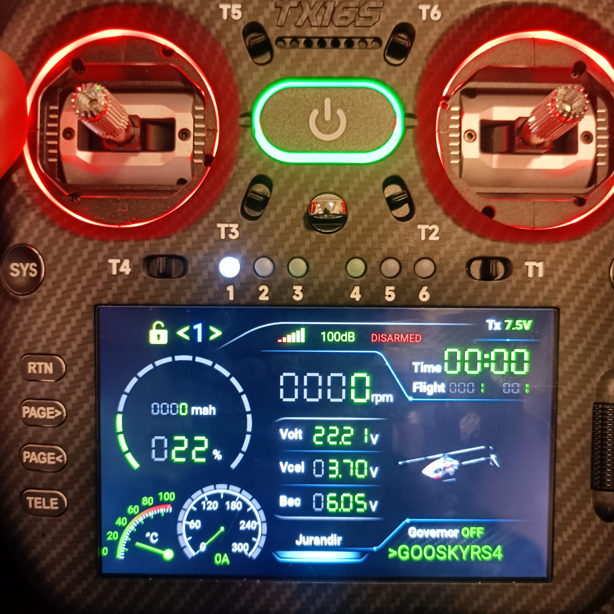

<div align="center">
  
</div>

# DBK_TX16KMK3

> **This is a fork of a fork.** Two people did the work this repository builds on:
>
> - **Bei Ke** ([liuhm2019-crypto/DBK_TX16KMK3](https://github.com/liuhm2019-crypto/DBK_TX16KMK3))
>   wrote the original DBK telemetry widget, the layout idea and the base that made
>   everything after it possible.
> - **Vagner Huzalo** ([vhuzalo/DBK_TX16KMK3](https://github.com/vhuzalo/DBK_TX16KMK3))
>   rebuilt it for the **TX16 MK3** and added the audio alerts, RGB LED control, JSON
>   configuration, performance work and deploy tooling. This fork starts from his v1.0.6.
>
> The plan here is to keep developing the script and to offer worthwhile features and
> fixes back to them, not to split the project.
>
> **Donate**
> If you find the DBK Telemetry Script useful, please consider supporting the original
> author by donating via PayPal: `aliuge2000@163.com`
> When donating, feel free to include your email address, and new features will be sent
> to you for early testing.

Telemetry widget for **EdgeTX**, built for **Rotorflight** on **RadioMaster TX16 MK3** radios.

The goal of this project is a clean, readable main screen tuned for helicopters, showing
flight information, arm state, governor, audio alerts and the model images stored on the
SD card.

## Features

- Main screen laid out specifically for the TX16 MK3
- Real-time display of:
  - RSSI / link quality
  - RPM
  - main voltage
  - voltage per cell
  - BEC voltage
  - temperature
  - current
  - battery consumption
  - battery percentage
- `ARM` status, with `disable flags` taking priority
- `Governor` state display
- Flight counter and flight timer
- Pilot name read from a configuration file on the SD card
- Audio alerts for:
  - armed
  - disarmed
  - governor `OFF`
  - governor `SPOOLUP`
  - governor `ACTIVE`
  - profile change
  - low battery
- Triple haptic alert for low battery
- Optional control of the radio LEDs:
  - configurable colour when armed
  - configurable colour when disarmed
  - animation in the disarmed colour when a `disable flag` is present
- Model images taken from the `/IMAGES` folder on the SD card
- Per-session flight timer
- Flight count per model

## Requirements

- A radio running **EdgeTX**
- Rotorflight with CRSF telemetry working
- An SD card set up for Lua widgets

## Installation

Download the most recent `.zip` release here:

[Download DBK_TX16KMK3 v1.0.6 (.zip)](https://github.com/vhuzalo/DBK_TX16KMK3/releases/download/v1.0.6/DBK_TX16KMK3-v1.0.6.zip)

After downloading:

1. Extract the `.zip` file.
2. Copy the `DBK_TX16KMK3` folder to the radio SD card.

Copy the contents of this project into the following folder on the SD card:

```text
/WIDGETS/DBK_TX16KMK3/
```

The main widget files should end up like this:

```text
/WIDGETS/DBK_TX16KMK3/main.lua
/WIDGETS/DBK_TX16KMK3/config.lua
/WIDGETS/DBK_TX16KMK3/audio/
/WIDGETS/DBK_TX16KMK3/image/
```

To set the pilot name shown in the widget footer, also create this file:

```text
/WIDGETS/DBK_TX16KMK3_config.json
```

Then on the radio:

1. Open the page where you want the widget.
2. Choose a layout that supports a full-screen widget.
3. Select the `DBK_TX16KMK3` widget.
4. Adjust the options as needed.

## Model images

Model images come from one place only:

```text
/IMAGES/
```

The widget uses the image you assign to the model in EdgeTX under **Model Setup**. Open
the model, pick a picture in the model image field, and the widget shows it. Nothing is
derived from the model name, so you can name your models however you like, with or
without a leading `>`.

If the model has no image assigned, or the assigned file is missing from `/IMAGES/`, the
widget falls back to its own default picture.

## Widget configuration

The widget has the following options:

- `SquareColor`: colour of labels and secondary elements
- `ValueColor`: colour of the main values
- `DispLED`: enables or disables the radio LEDs
- `ArmLED`: LED colour while the model is armed
- `DisarmLED`: LED colour while the model is disarmed, and the base colour of the `disable flags` animation
- `UseGovernor`: enables or disables reading and showing the governor
- `HoldSwitch`: switch used to freeze minimums and maximums
- `BatAlertPct`: battery percentage that triggers the low battery alert

The initial default for `BatAlertPct` comes from `battery_alert_pct` in the configuration
file. If that key is missing, the default is `25`.

`ArmLED` and `DisarmLED` offer red, green, blue, yellow, cyan, magenta, white, orange,
purple and pink. The defaults are blue for armed and red for disarmed. Like the other
widget options, these values are stored by EdgeTX itself, not in the JSON file.

## JSON configuration

The widget reads settings from:

```text
/WIDGETS/DBK_TX16KMK3_config.json
```

It currently supports these keys:

- `pilot_name`: name shown in the footer
- `battery_alert_pct`: default percentage for the battery alert
- `battery_alert_interval`: interval between low battery alerts, in seconds

Example:

```json
{
  "pilot_name": "Victor",
  "battery_alert_pct": 25,
  "battery_alert_interval": 10
}
```

If the file is missing, empty, or does not carry one of these keys, the widget uses these
defaults:

```text
pilot_name = Rotorflight
battery_alert_pct = 25
battery_alert_interval = 10
```

At startup, if `/WIDGETS/DBK_TX16KMK3_config.json` is missing or empty, the widget tries
to create it automatically with the default values.

## Changes in this fork

- Model images come only from the image assigned in EdgeTX **Model Setup**. The lookup
  derived from the model name is gone, so the `>` naming convention no longer matters and
  the `modelImage/` folder has been removed.
- Everything in the repository is in English: comments, scripts, release notes and docs.
- Runtime images live in `image/`, matching the lowercase path `main.lua` actually opens.
  Documentation screenshots live in `doc/images/` and are no longer shipped to the radio.
- Compiled `.luac` artifacts are ignored, so a stale one cannot shadow an updated
  `main.lua`.
- The `deploy.sh` installer is gone. Installing the widget means copying files to the SD
  card, and a 290 line shell script that probes mount points and downloads GitHub
  releases is more machinery than a file copy needs.

## What's new in v1.0.6

- model images found with or without the `>` prefix in the name
- fallback to the image configured in EdgeTX Model Setup before the default image
- configurable LED colours for the armed and disarmed states
- `disable flags` animation using the colour chosen for disarmed
- new caches for geometry, displays, colours, timers and animations, to reduce CPU use

## What's new in v1.0.5

- reduced memory use and temporary table creation while drawing
- removed the curve collection that was already marked as disabled
- JSON reload cut to once per minute, and debug output limited to startup
- rendering limited to 10 FPS, with gauge geometry reused between frames
- fixed the full-screen behaviour triggered by touching the EdgeTX screen

## What's new in v1.0.3

- fixed the low battery alert so it respects the value stored in `BatAlertPct` in the widget options
- removed the runtime overwrite of the alert percentage from the JSON, which kept the warning firing on an old value

## What's new in v1.0.2

- `BatAlertPct` switched to a numeric input, easier to adjust with the scroller
- pilot name moved out of the widget options and into a JSON file on the SD card
- new `/WIDGETS/DBK_TX16KMK3_config.json` file for settings that persist outside the widget folder
- support for the `pilot_name`, `battery_alert_pct` and `battery_alert_interval` keys
- the configuration file is created automatically with default values when missing or empty
- configuration reloaded at runtime
- configuration logic extracted into `config.lua`, leaving `main.lua` cleaner

## Expected telemetry

The widget is built to work with Rotorflight/CRSF sensors such as:

- `Vbat`
- `Curr`
- `Hspd`
- `Capa`
- `Bat%`
- `Tesc`
- `1RSS`
- `RQly`
- `Thr`
- `Vbec`
- `ARM`
- `Gov`
- `Vcel`
- `PID#`
- `ARMD`

The simplest way to enable all the sensors it needs is to run this command in the CLI:

```text
set telemetry_sensors = 3,4,5,6,7,8,43,50,60,88,90,91,99,95,96,15,0,0,0,0,0,0,0,0,0,0,0,0,0,0,0,0,0,0,0,0,0,0,0,0
```

## Alerts and behaviour

### Flight timer

The `Time` field shows the duration of the current flight.

- the timer starts counting when the model becomes armed
- the timer stops when the model is disarmed
- it represents the current flight session, not a running total for the radio

That makes it a quick reference for the flight in progress, which is mostly useful for
battery management.

### Flight count per model

The `Flight` field shows two counters:

- the left value is the accumulated total of flights for that model on the radio
- the right value is the number of flights recorded for the model in the context the widget is currently showing

Counting is per model, so each aircraft keeps its own separate history.

A new flight is only counted on a valid flight cycle, which avoids miscounts from very
short arm and disarm cycles.

### ARM and disable flags

- When `disable flags` are present, the lock text takes priority over `ARMED`
- The field uses the same screen area as the arm status
- `disable flags` appear in red
- `ARMED` appears in yellow

### Governor

The governor state can come from:

- the `Gov` sensor directly, when available
- or be inferred from the throttle, following the logic already used in RFMONO

If `UseGovernor` is disabled in the widget settings, the script stops reading the
governor and also turns off its display and the related audio.

### Low battery

When the battery reaches the configured percentage:

- the widget plays the alert audio
- it fires 3 haptic pulses

## Troubleshooting

### The flight controller is not detected when flashing

If your PC does not see the flight controller in DFU mode while you flash Rotorflight,
this is almost always a Windows STM32 driver problem rather than a fault on the board.
The **ImpulseRC Driver Fixer** is the usual tool for it: run it, then plug the board in
while it waits, and it installs the correct DFU driver.

Download it from the ImpulseRC downloads page: <https://impulserc.com/pages/downloads>

That executable used to be committed to this repository. It has been removed, because
shipping a third-party Windows binary inside a Lua widget repository is a bad idea:
nobody can tell which version it is or whether it has been tampered with. Get it from
the vendor instead.

### The widget shows the default picture instead of my model image

Check, in order:

1. The model has an image assigned in EdgeTX **Model Setup**.
2. That file actually exists in `/IMAGES/` on the SD card.
3. The image is in a format EdgeTX can open. A `250x150 px` PNG works well.

The widget no longer looks for an image matching the model name, so renaming a model has
no effect here.

## Notes

- This project targets **EdgeTX**, not Ethos
- The `doc/` folder is documentation only and is not part of the radio installation
- The `image/` folder holds the pictures the widget draws; `doc/images/` holds documentation screenshots only

## Version

Current widget version: **v1.0.6**. This fork is based on that release.
